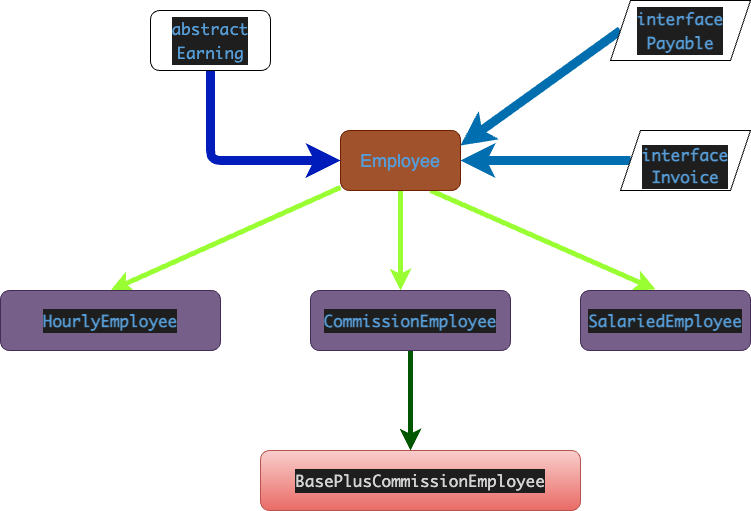

 

### 任務一：設計一個抽象(abstract) 類別「Earning」：
- 需要建立一個抽象(abstract)方法為「earnings」

### 任務二：設計界面(interface)「Payable」、「Invoice」：
- 需要為「Payable」建立「getPaymentAmount」方法
- 需要為「Invoice」建立「getTax」方法
  
### 任務三：設計一個類別「Employee」繼承 「Earning」，引用「Payable」、「Invoice」界面
- 需要建立「name」、「mobile」屬性以及屬性的取得、設定方法
- 需要建立「Employee」方法，代表類別建構式，且可初始化設定「name」、「mobile」
- 需要覆寫「toString」方法，空白
- 需要覆寫「getTax」方法，空白
- 需要覆寫「earnings」方法，空白
- 需要覆寫「getPaymentAmount」方法，空白

### 任務四：設計一個類別「HourlyEmployee」，繼承「Employee」：
- 需要建立「wage」 、「hours」屬性以及屬性的取得、設定服務方法
- 需要建立「HourlyEmployee」方法，代表類別建構式 ，且可初始化設定「name」、「mobile」、「wage」、「hours」
- 請覆寫「toString」方法，提供顯示時薪員工各項基本資料「name」、「mobile」的功能
- 需要覆寫「getTax」方法，代表取得稅額的功能(wage * hours * 0.05)
- 需要覆寫「earnings」方法，代表取得員工未扣稅所得(wage * hours)
- 需要覆寫「getPaymentAmount」方法，代表取得員工扣稅所得功能(wage * hours) - (wage * hours * 0.05)
- 各種屬性實體變數於操作屬性寫入時需實作數値合理範圍的檢査功能

### 任務五：設計一個類別階層，分別為「CommissionEmployee」、「SalariedEmployee」2個類別，繼承「Employee」：
- 需要分別建立 「grossSales」、「commissionRate」、「baseSalary」屬性，以及屬性的取得、設定方法
- 需要分別建立 「CommissionEmployee」、「SalariedEmployee」方法，代表類別建構式，且可初始化設定「name」、「mobile」、「grossSales」、「commissionRate」、「baseSalary」
- 需要分別為 「CommissionEmployee」、「SalariedEmployee」覆寫「toString」方法，提供顯示時薪員工各項基本資料「name」、「mobile」的功能
- 需要分別為 「CommissionEmployee」、「SalariedEmployee」覆寫「getTax」方法，代表取得稅額的功能((grossSales * commissionRate + baseSalary) * 0.05)
- 需要分別為 「CommissionEmployee」、「SalariedEmployee」覆寫「earnings」方法，代表取得員工未扣稅所得(grossSales * commissionRate + baseSalary)
- 需要分別為 「CommissionEmployee」、「SalariedEmployee」覆寫「getPaymentAmount」方法，代表取得員工扣稅所得功能(grossSales * commissionRate + baseSalary) - ((grossSales * commissionRate + baseSalary) * 0.05)
- 各種屬性實體孌數於操作屬性寫入時需實作數值合理範圍的檢查功能

### 任務六：設計一個類別 「BasePlusCommissionEmployee」，繼承 「CommissionEmployee」:
- 將 CommissionEmployee 之獎金比率提高至 30%

### 任務七：設計一個類別 「PaymentSystem」，具備程式進入點Main()功能，利用多型印出各個員工的薪資：
- 至少需要內含一個 HourlyEmployee 實體物件 
- 至少需要內含一個 SalariedEmployee 實體物件
- 至少需要內含一個 ComrissionEmployee、一個 BasePlusCommissionEmployee 實體物件
- 請利用toString、getTax、earnings、getPaymentAmount 方法，進行 Employee 多型呼叫，以輸出所有應付帳款明細項目